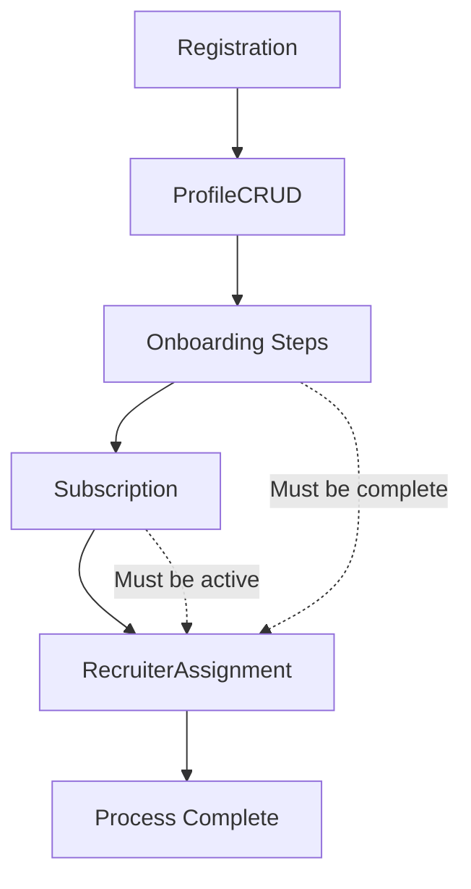

# Hyrind-Backend Project Documentation

## Overview
A modular Django REST API for client onboarding, hiring, subscription management, and recruiter assignment. Implements best practices for workflow enforcement, authentication, and extensibility.

---

## Features Implemented

### 1. User Registration & Profile
- Registration endpoint with password confirmation and terms acceptance
- Profile CRUD (first_name, last_name, email, phone, university, degree, major, visa_status, graduation_date, resume_file)
- Email-based authentication (email is used as username)

### 2. Authentication
- JWT authentication using djangorestframework-simplejwt
- Secure login and token refresh endpoints

### 3. Onboarding Workflow
- Step-by-step onboarding tracked per user
- Steps: profile, documents, agreements, questions, review
- API restricts recruiter assignment until onboarding is complete

### 4. Subscription Management
- Subscription model linked to user profile
- Stripe integration scaffolded for payment processing
- Endpoints for subscription creation, retrieval, and status tracking

### 5. Recruiter Assignment
- Recruiter model and assignment logic
- Only admin users can assign recruiters
- Assignment only possible after onboarding completion

### 6. Permissions & Workflow Enforcement
- DRF permissions (`IsAuthenticated`, `IsAdminUser`)
- Custom logic in views to restrict actions based on workflow status
- Clear API responses for errors and guidance

---

## Workflow Diagram

---

## Best Practices Followed
- Modular Django apps for separation of concerns
- Step-by-step onboarding with progress tracking
- Permissions and custom logic for workflow enforcement
- Stripe-ready subscription logic
- Admin-only sensitive actions
- Clear, maintainable code structure

---

## Recommendations for Further Enhancement
- Add signals for automation (e.g., notify recruiter on assignment)
- Integrate Celery for async notifications
- Build admin dashboards for workflow monitoring
- Add logging and audit trails
- Expand onboarding steps and conditional logic
- Integrate frontend for guided user experience

---

## API Endpoints Summary
- `/api/users/register/` — User registration (requires email, password, first_name, last_name, phone, resume_file)
- `/api/token/` — JWT login (requires email and password)
- `/api/token/refresh/` — JWT refresh
- `/api/users/profiles/<uuid:id>/` — Profile retrieve/update/delete by UUID
- `/api/onboarding/` — Onboarding steps
- `/api/subscriptions/` — Subscription management
- `/api/recruiters/assign/` — Recruiter assignment (admin only)

---

## How Workflows Are Enforced
- Recruiter assignment only after onboarding completion
- Subscription status can be checked before assignment
- Permissions restrict sensitive actions to admins
- API responses guide users through each workflow step

---

## Extensibility
- Easily add new onboarding steps or subscription plans
- Integrate more payment providers
- Add more user roles and permissions
- Automate notifications and monitoring

---

## Contact & Support
For questions or contributions, contact the project owner or open an issue in the repository.
